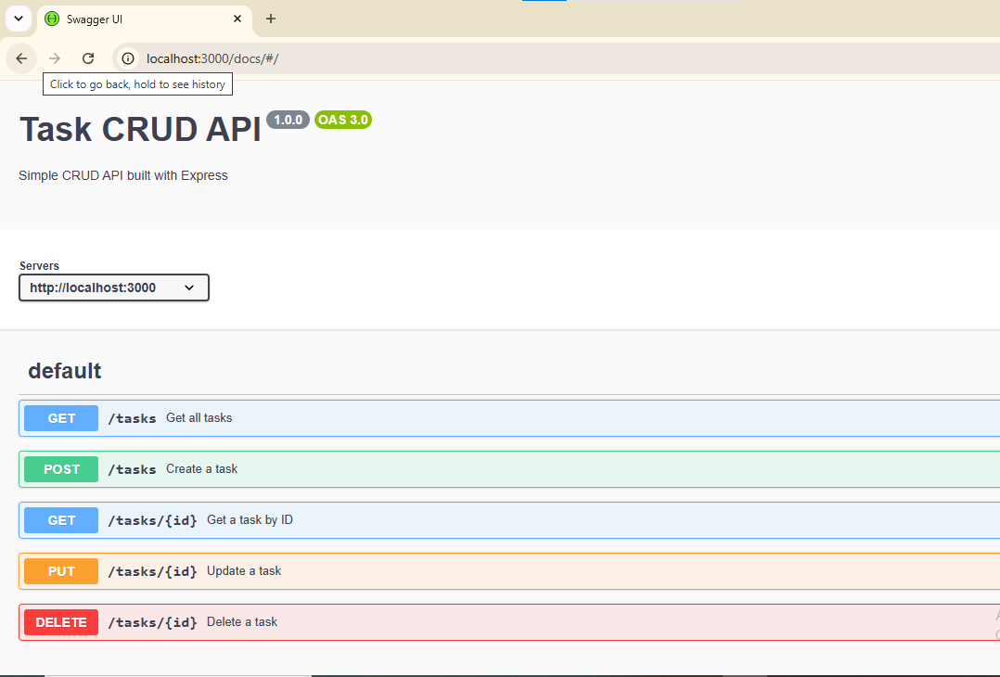
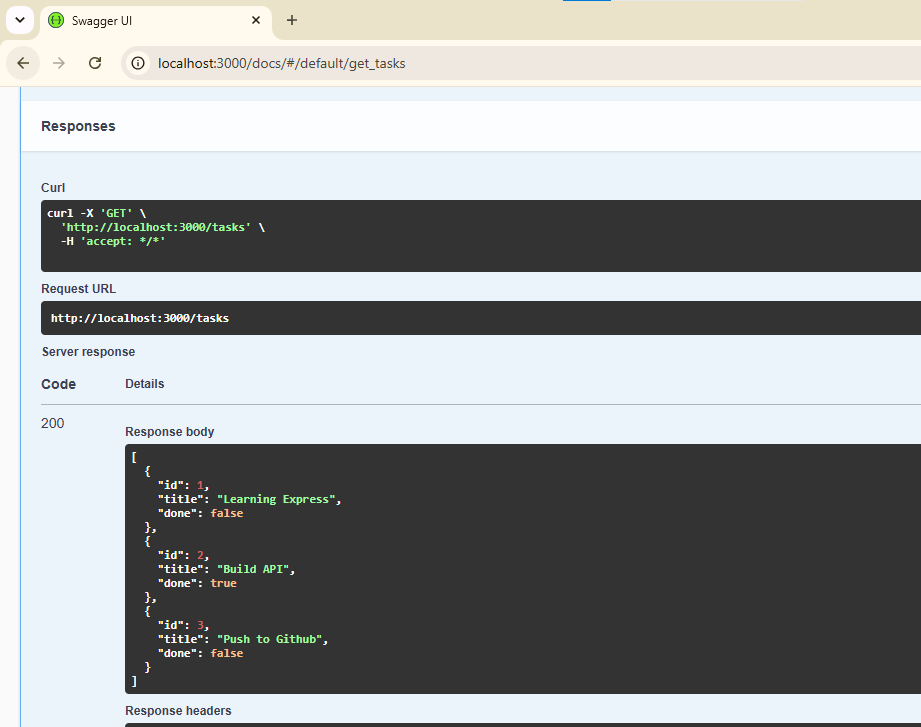
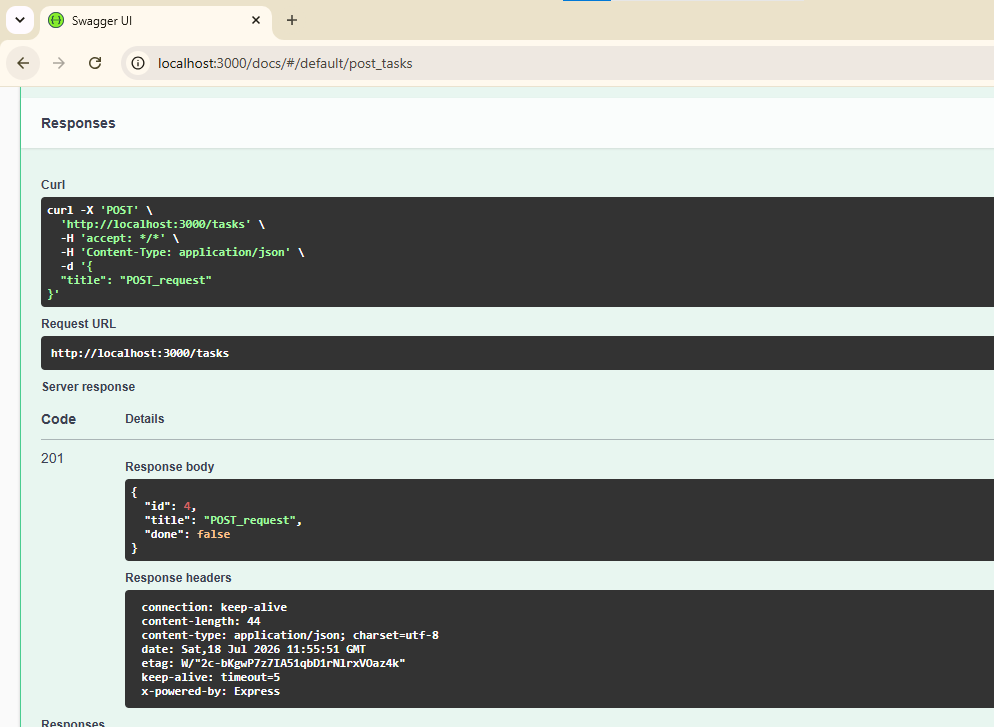
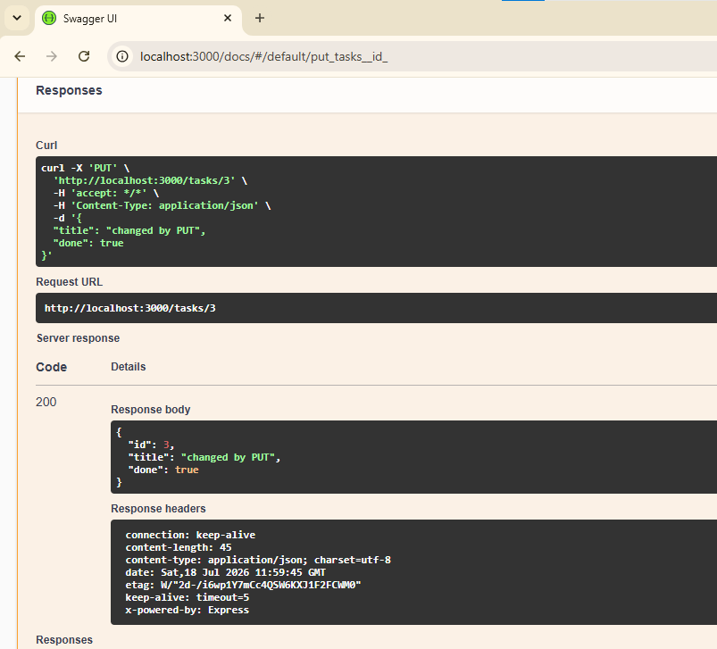
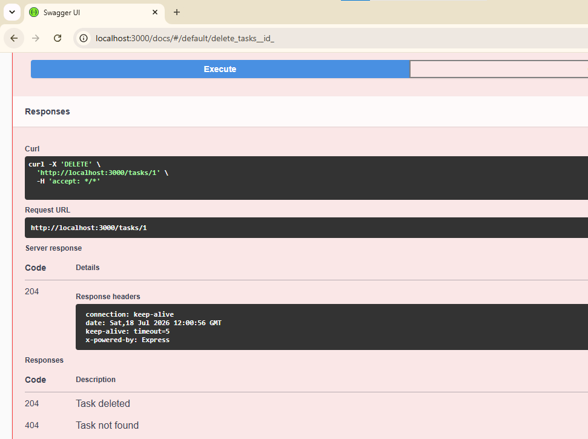
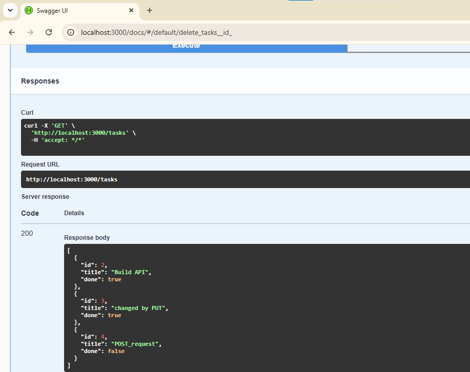

# NodeJS CRUD API

A simple RESTful CRUD API built with **Node.js**, **Express**, and **Swagger UI**.

## Features

- Create tasks
- Read all tasks
- Read a single task
- Update tasks
- Delete tasks
- Interactive API documentation using Swagger UI

---

## Installation

### Clone the repository

```bash
git clone https://github.com/<your-username>/NodeJS_CRUD_API.git
cd NodeJS_CRUD_API
```

### Install dependencies

```bash
npm install
```

### Run the server

```bash
npm start
```

The server runs at:

```
http://localhost:3000
```

Swagger UI:

```
http://localhost:3000/docs
```

---

## API Endpoints

| Method | Endpoint | Description |
|---------|----------|-------------|
| GET | `/` | API Details |
| GET | `/about` | About information |
| GET | `/tasks` | Get all tasks |
| GET | `/tasks/:id` | Get a task by ID |
| POST | `/tasks` | Create a task |
| PUT | `/tasks/:id` | Update a task |
| DELETE | `/tasks/:id` | Delete a task |

---

## Example cURL

```bash
curl -i -X POST http://localhost:3000/tasks -H "Content-Type: application/json" -d "{\"title\":\"Buy Milk\"}"
```

Example response:

```http
HTTP/1.1 201 Created
X-Powered-By: Express
Content-Type: application/json; charset=utf-8
Content-Length: 40
ETag: W/"28-9vVjltvpdnv2purknMZG9437OJQ"
Date: Thu, 16 Jul 2026 09:00:36 GMT
Connection: keep-alive
Keep-Alive: timeout=5

{
  "id":4,
  "title":"Buy Milk",
  "done":false
}
```

---

## Swagger UI

Open:

```
http://localhost:3000/docs
```




---
1. Get all tasks API:
   

2. POST API:
   
3. PUT API:
   
4. DELETE API:
   
5. All tasks after the CRUD operations:
   
---
## Technologies Used

- Node.js
- Express.js
- Swagger UI Express